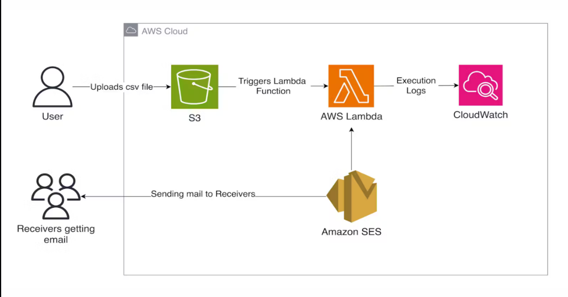
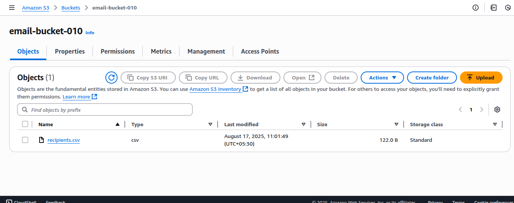
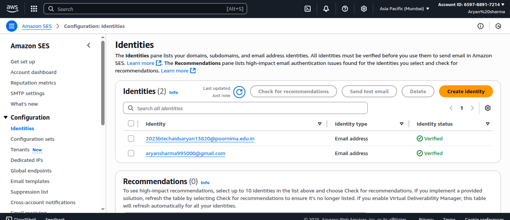
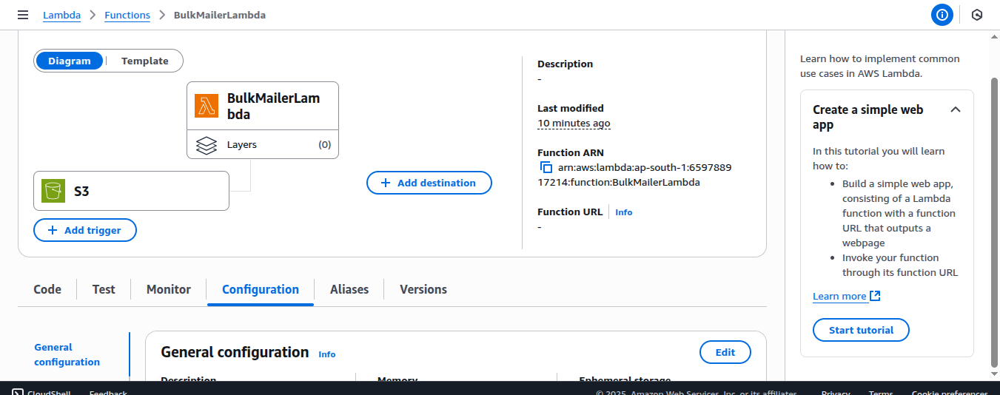
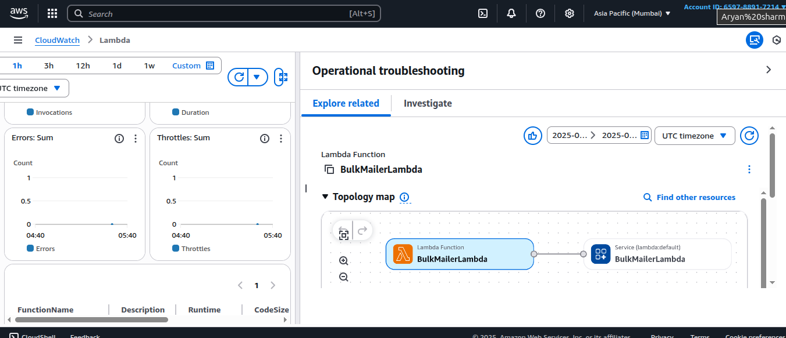
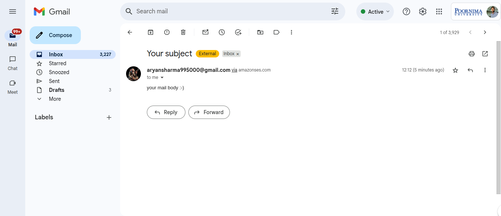

# Mass Emailing System (AWS Lambda, SES, S3)

## 🚀 Overview

The **Mass Emailing System** is a serverless AWS-powered tool for sending bulk emails efficiently and securely. It automatically processes uploaded CSV files to send personalized emails using Amazon SES, triggered by S3 events and managed by Lambda.

---

## 🛠️ Features

- **Serverless:** No server maintenance, automatic scaling
- **Bulk Emailing:** Easily send high volumes of personalized messages
- **AWS Integrated:** Uses S3, Lambda, SES, and CloudWatch
- **Secure:** Data and sending handled fully in your AWS account
- **Monitorable:** Detailed logs and metrics in CloudWatch

---

## 📦 Architecture

1. **User uploads CSV file to S3 Bucket**
2. **S3 event triggers AWS Lambda**
3. **Lambda reads each recipient from CSV and sends using SES**
4. **Logs/monitoring through CloudWatch**

---

## 📷 Screenshots

| S3 Bucket                        | SES Identities                  |
|-----------------------------------|---------------------------------|
|  |  |

| Lambda Function                  | CloudWatch Logs                 |
|-----------------------------------|---------------------------------|
|  |  |

| Received Email Example           |
|---------------------------------|
|  |

---

## 📝 Getting Started

### 1. Clone This Repo

git clone https://github.com/AryanSharma2206/Mass-Emailing-System.git
cd Mass-Emailing-System

text

### 2. AWS Setup

- **S3 Bucket:** Create a bucket for CSV uploads
- **SES Setup:** Verify your sender identity (and recipient(s) if still in SES sandbox)
- **Lambda:** Deploy Lambda, add IAM permissions
- **S3 Trigger:** Set S3 to invoke Lambda on new CSV upload

### 3. Prepare Your CSV

email,first_name,last_name
example1@email.com,First,Last
example2@email.com,Another,Person

text

Upload your CSV to the bucket.

### 4. Monitor and Verify

- **Logs:** See [CLOUDE-WATCH.png](Mass-Email-project/CLOUDE-WATCH.png)
- **Email receipt:** See [Recived-email.png](Mass-Email-project/Recived-email.png)

---

## 🗝️ Example IAM Policy (Lambda)

For S3 access:
{
"Effect": "Allow",
"Action": ["s3:GetObject"],
"Resource": "arn:aws:s3:::email-bucket-010/*"
}

text
Add "ses:SendEmail" permissions as well.

---

## 🖼️ Images/Diagram

Find all screenshots and diagrams in `Mass-Email-project/`:

- `Flow-chart.png` - Overall architecture
- `BUCKET.png` - S3 bucket setup
- `SES-identities.png` - SES sender/recipient verification
- `LAMDA-FUNCTION.png` - Lambda config
- `CLOUDE-WATCH.png` - CloudWatch logs
- `Recived-email.png` - Example result

---

## 👨‍💻 Author

**Aryan Sharma**  
B.Tech CSE (AI & DS) | Poornima University  
GitHub: [@AryanSharma2206](https://github.com/AryanSharma2206)  
LinkedIn: [linkedin.com/in/aryan-sharma2206](https://www.linkedin.com/in/aryan-sharma-a2a240353/)  
Location: Jaipur, India

For any questions or issues, please use the Issues section on GitHub.
